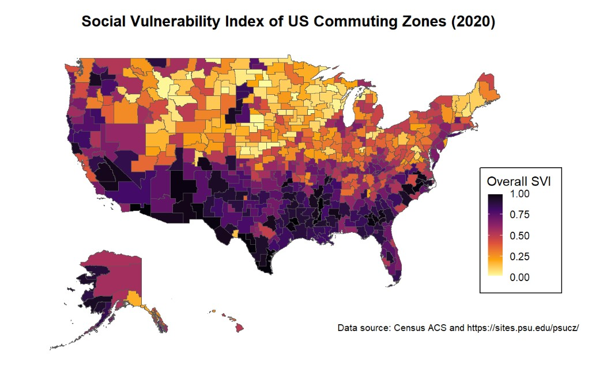

```{r, include = FALSE}
knitr::opts_chunk$set(
  collapse = TRUE,
  comment = "#>"
)
```

The findSVI package originally calculated SVI at standard Census geographic levels, with data retrieval and SVI calculations performed at the same level. We've recently expanded the functionality of the package to support SVI calculations for custom geographic boundaries in which the Census geographies are fully nested.

Here we are using commuting zones as an example to demonstrate the new feature to support user-defined boundaries for SVI calculation.

```{r setup, warning=FALSE, message=FALSE}
library(dplyr)
library(findSVI)
library(sf)
library(ggplot2)
library(cowplot)
library(stringr)
library(readr)
library(tidyr)
```

# Commuting zones

First proposed by [Tolbert and Killian in 1987](https://scholar.google.com/scholar_lookup?&title=Labor%20market%20areas%20for%20the%20United%20States&publication_year=1987&author=Tolbert%2CC&author=Killian%2CM) and updated by [Fowler, Jensen and Rhubart in 2016](https://link.springer.com/article/10.1007/s11113-016-9386-0#ref-CR32), commuting zones (CZs) offer a geographic delineation to understand regional labor market, taking into account the commuter flow data and American Community Survey (ACS) data. 

Geographically, CZs are based on counties (i.e., counties are fully nested in CZs) and cover the entire US. Therefore, to calculate SVI for CZs, we can retrieve the data at the county level and use a crosswalk to combine the counties to CZs level.

# Workflow
## Set up a crosswalk

In addition to the year and region of interest for SVI calculation, we need to supply a user-defined crosswalk (relationship file) between the Census geography and customized geography. For example, the crosswalk between CZ and county for 2020 is downloaded from [the Penn State Commuting Zones / Labor Markets data repository](https://sites.psu.edu/psucz/), and modified to keep only the IDs for counties and CZs. The resulting table `cty_cz_2020_xwalk` is stored in the package as an example and a template for the crosswalk. Note that the crosswalk should be a data frame, with column names `GEOID` representing the Census geography (county) and `GEOID2` representing the user-defined geography (CZ). `GEOID` should be completed nested in `GEOID2` so that the census data can be accurately aggregated to the customized geographic level. 

Optionally, the crosswalk can include another column `NAME` for the description or name of the user-defined geography, which will be included in the final SVI output.

## `find_svi_x()`

To obtain SVI *with geometries* for CZs in the US for 2020, we can use `find_svi_x()` to retrieve nation-level census data, aggregate to CZ level, and calculate CZ-level SVIs.

```{r, eval=FALSE}
cz_svi_geo <- find_svi_x(
  year = 2020,
  geography = "county",
  xwalk = cty_cz_2020_xwalk, #county-commuting zone crosswalk
  geometry = TRUE
)
```

Alternatively, we can separate the data retrieval and SVI calculation for more fine-tuning action, via `get_census_data()` with `exp=TRUE` and `get_svi_x()`

```{r, eval=FALSE}
data_geo <- get_census_data(
  year = 2020, 
  geography = "county",
  geometry = TRUE,
  exp = TRUE
)

svi_geo <- get_svi_x(
  year = 2020,
  data = data_geo,
  xwalk = cty_cz_2020_xwalk #county-commuting zone crosswalk
)
```

To visualize the overall SVI for each CZ in the US (the higher the SVI, the more vulnerable a community is considered):

```{r, eval=FALSE}
continent <- ggplot()+ 
  geom_sf(data = svi_geo, aes(fill = RPL_themes))+
  coord_sf(xlim = c(-130, -60), ylim = c(23, 50)) +  
  # Adjust xlim and ylim to focus on continental US
  scale_fill_viridis_c(option = "inferno", direction = -1) +
  labs(
    title = "Social Vulnerability Index of US Commuting Zones (2020)",
    caption = "Data source: Census ACS and https://sites.psu.edu/psucz/",
    fill = "Overall SVI"
    ) +
  theme_minimal()+
  theme(
    plot.title = element_text(face = "bold", hjust = 0.5),
    plot.caption = element_text(size = 8),
    axis.text = element_blank(),
    panel.grid = element_blank(),
    legend.key.size = unit(0.5, "cm"),
    legend.position = "inside",
    legend.position.inside = c(0.9, 0.3),
    legend.frame = element_rect(color = "white", linewidth = 1),
    #legend.background = element_rect(color = "black"),
    legend.box.background = element_rect(color = "black"),
    legend.box.margin = margin(0,1,3,0, unit = "mm")
  )

#Alaska
inset_ak <- ggplot() +
  geom_sf(data = svi_geo, aes(fill = RPL_themes)) +
  coord_sf(xlim = c(-179.5,-130), ylim = c(51.2, 71.5)) +
  scale_fill_viridis_c(option = "inferno", direction = -1) +
  theme_minimal()+
  theme(
    axis.text = element_blank(),
    panel.grid = element_blank(),
    legend.position = "none"
  )

#Hawaii
inset_hi <- ggplot()+ 
  geom_sf(data = svi_geo, aes(fill = RPL_themes))+
  coord_sf(xlim = c(-178.3, -154.8), ylim = c(18.9, 28.5)) +  
  scale_fill_viridis_c(option = "inferno", direction = -1) +
  theme_minimal()+
  theme(
    axis.text = element_blank(),
    panel.grid = element_blank(),
    legend.position = "none"
  )

ggdraw(continent) + 
  draw_plot(inset_ak, -0.3, -0.3, scale = 0.3) +
  draw_plot(inset_hi, -0.2, -0.3, scale = 0.3)
```



If spatial information is not needed, we can leave out the `geometry` argument (`geometry = FALSE` is default) in `find_svi_x()` or `get_census_data()` to obtain only the SVI variables.

# Validation

In [Validation of SVI results](svi-validation.html), we have documented the comparison between SVI results from findSVI and CDC database in standard operation. To validate the modified variable list and the calculation table when `exp=TRUE`, we'll use a pseudo-crosswalk with replicating the county IDs (county-county crosswalk) and compare the results from `find_svi_x()` with CDC SVI.

The first 10 rows of the pseudo-crosswalk look like this:

```{r}
ps_xwalk <- cty_cz_2020_xwalk %>%
  select(GEOID) %>% 
  mutate(GEOID2 = GEOID)

ps_xwalk %>% head(10)
```

Supplying the crosswalk to `find_svi_x()`, we are "aggregating" each county to itself, producing county-level SVIs for comparison with CDC SVI. The main goal is to validate that our modified variable calculations using explicit denominators for percent estimates produce results consistent with the CDC database.

```{r, eval=FALSE}
pa_cty_svi_x2020 <- find_svi_x(
  year = 2020,
  geography = "county",
  state = "PA",
  xwalk = ps_xwalk
)
```
```{r, echo=FALSE}
load(system.file("extdata","pa_cty_svi_x2020.rda",package = "findSVI"))
```

Now we are ready to compare this result with CDC's county-level SVI for PA for 2020 downloaded from [CDC/ATSDR SVI data](https://www.atsdr.cdc.gov/placeandhealth/svi/data_documentation_download.html)

```{r}
load(system.file("testdata","cdc_pa_cty_svi2020.rda",package = "findSVI"))
#FIPS renamed to GEOID 

join_RPL <- cdc_pa_cty_svi2020 %>%
    select(GEOID,
      cdc_RPL_themes = RPL_THEMES,
      cdc_RPL_theme1 = RPL_THEME1,
      cdc_RPL_theme2 = RPL_THEME2,
      cdc_RPL_theme3 = RPL_THEME3,
      cdc_RPL_theme4 = RPL_THEME4) %>%
    mutate(GEOID = paste(GEOID)) %>%
    left_join(pa_cty_svi_x2020 %>%
        select(GEOID,
          RPL_themes,
          RPL_theme1,
          RPL_theme2,
          RPL_theme3,
          RPL_theme4)) %>%
    drop_na() %>%   ## remove NA rows
    filter_all(all_vars(. >= 0)) #-999 in cdc data

coeff <- cor(join_RPL$cdc_RPL_themes, join_RPL$RPL_themes)

join_RPL %>% 
  ggplot(aes(x = cdc_RPL_themes, y = RPL_themes)) +
  geom_point(color = "#004C54")+
  geom_abline(slope = 1, intercept = 0)+
  labs(
    title = "CDC vs. find_svi_x() county-level SVI for PA, 2020",
    subtitle = paste0("Comparison of overall percentile rankings (RPLs), correlation coefficient = ", coeff),
    y = "find_svi_x()",
    x = "CDC")+
  theme(plot.title = element_text(size= 14, face = "bold"))


```

# Appendix: mapping SVI (percentage) variables to census variables

Currently, the variable retrieval process by `get_census_data()` follows the [CDC/ATSDR SVI documentation](https://www.atsdr.cdc.gov/placeandhealth/svi/data_documentation_download.html) strictly, where SVI variables starting with "EP\_" (percent estimate) are sometimes obtained directly from Census, while in other cases are values computed from Census variables.

For example, in the variable table below for 2020, the calculation field (the last column) for `EP_UNEMP` is a Census variable and a calculation formula for `EP_POV150`. As a result, `DP03_0009PE` from Census is directly used as `EP_UNEMP`, whereas `S1701_C01_001E` is obtained from Census and used to calculate `EP_POV150` (along with `E_POV150`).

```{r}
#| fig-cap: "Table 1: 'EP_' variables in `variable_e_ep_calculation_2020` (`exp = FALSE`)"
variable_e_ep_calculation_2020 %>%
  filter(
    !theme == 5, 
    str_starts(x2020_variable_name, "EP_")
    ) 
```

However, for aggregation purposes, percent estimates cannot be summed up directly to a larger geographic level. Instead, we need to use summed "E\_" SVI variables (count estimate) and the corresponding "total" count to calculate the CZ-level percent. Therefore, we need to modify variables like `DP03_0009PE` for `EP_UNEMP` so that the calculation field for all "EP\_" variables are formula with explicitly defined denominator (total counts). For example:

```{r}
#| fig-cap: "Table 2: 'EP_' variables in `variable_cal_exp_2020` (`exp = TRUE`)"

variable_cal_exp_2020 %>% 
  filter(
    !theme == 5, 
    str_starts(x2020_variable_name, "EP_")
    ) 
```

To integrate the modified variable lists to `get_census_data()`, we introduce another argument `exp`, where we can specify which of the two variables list is used:

-   (Default) `exp = FALSE`: use variables following CDC/ATSDR documentation.

-   `exp = TRUE`: use variables with explicitly defined denominator.

For use with `get_svi_x()`, `exp = TRUE` is recommended.


